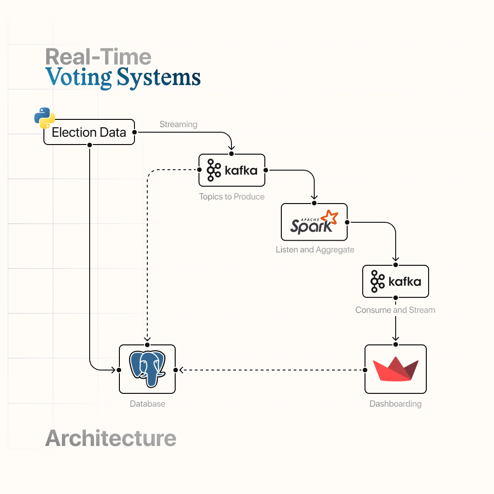
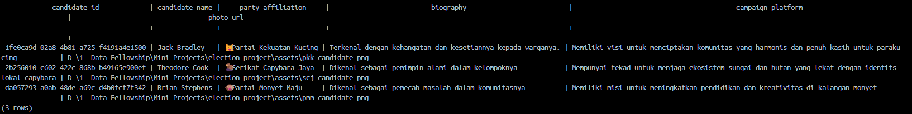
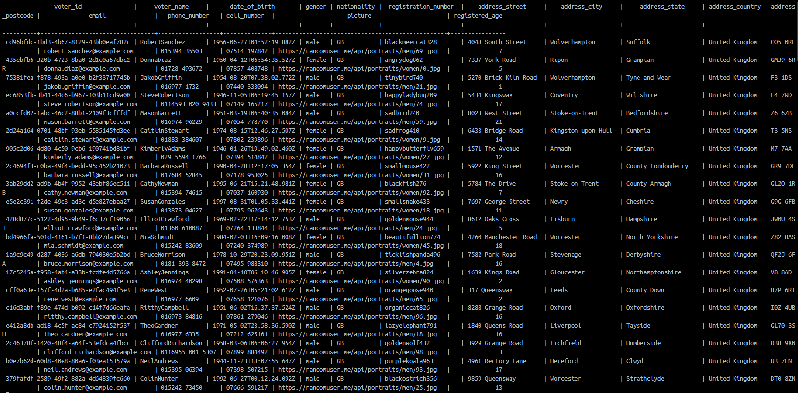
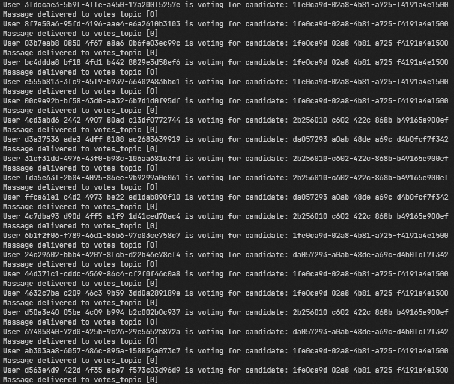

## 🚀 Real-Time Voting System 

Through this project i learn comprehensive real-time voting system. This project was inspired by recent indonesia elections and takes you through the entire election process.

## Election Flow

## Architecture

## Streamlit Dashboard

## Dataset
### Candidates & Parties

### Voters

### Voting

## Stack
- Python & SQL
- Apache Kafka
- Apache Spark
- Streamlit

## Code Flow
## main.py

1. **Making 3 tables**
    - Candidates
    - Voters
    - Votes

2. **Generate Candidate**
    1. Setting up the parties
    2. Ingesting candidate information into PostgreSQL

3. **Generate the voters**
    1. Ingesting voters information into PostgreSQL
    2. Making Kafka producer "voters_topic"

## voting.py

1. **Declare/read the recent candidate that already on the dataset**
2. **Setting up Kafka**
    1. Config on server
    2. Config on consumer
    3. Starting the producer
3. **Making Kafka subscribe (consumer) on "voters_topic"**
    1. Setup for error possibility
    2. Setup for vote system
    3. Ingesting the votes data

## spark-stream.py

1. **Setup SparkSession for streaming process**
2. **Define schema for Kafka topics**
3. **Read data from Kafka 'votes_topic'**
4. **Data preprocessing**
    1. Typecasting
    2. Watermarking
5. **Aggregate votes data per candidate**
6. **Sending the aggregate data to Kafka topics**
    1. Making votes Kafka checkpoint
    2. Making turnout Kafka checkpoint

## streamlit-app.py

1. **Set up the Streamlit app title**
2. **Define the Kafka topic name for aggregated votes**
3. **Call the `sidebar` function to display the sidebar**
4. **Call the `update_data` function to fetch and display data on the dashboard**